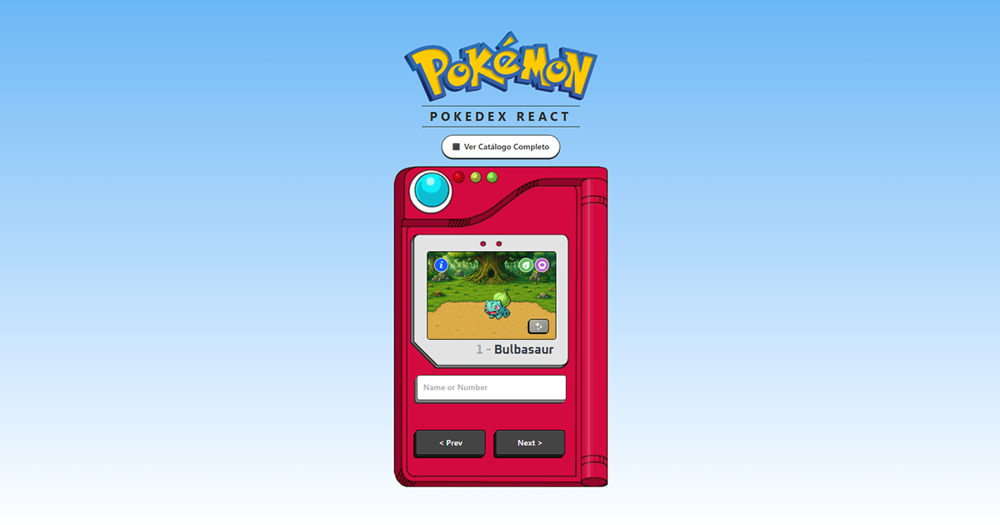
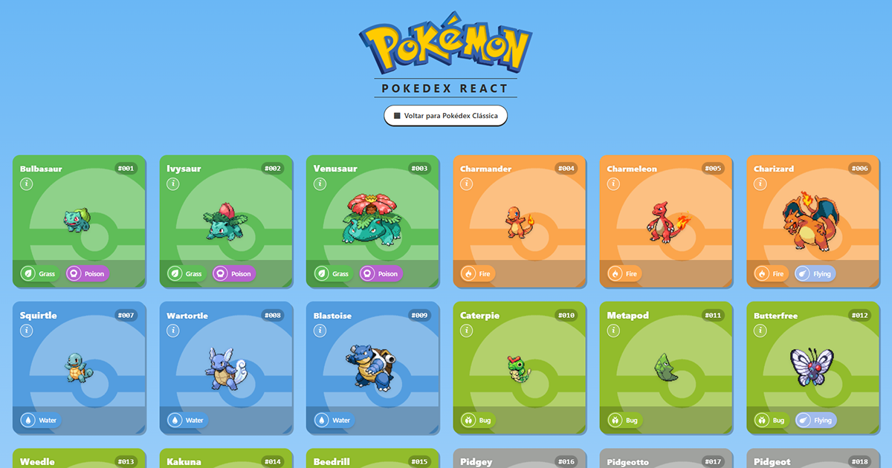
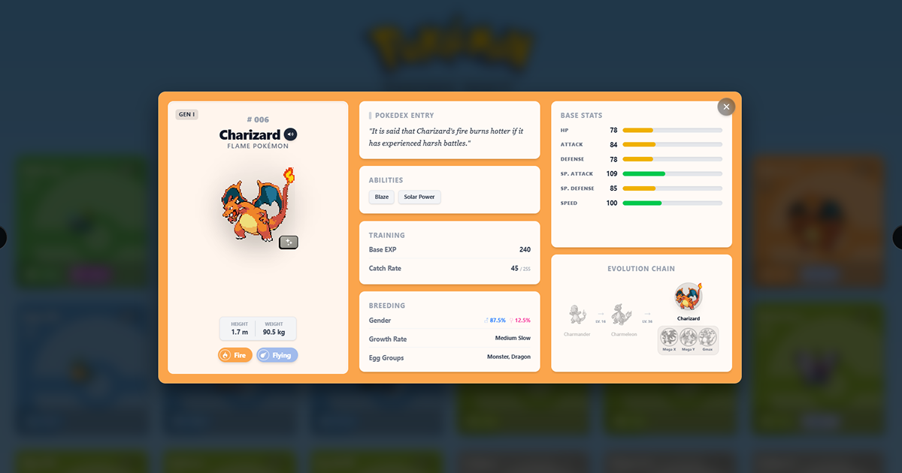

# 📱 Pokédex Application

An interactive and responsive web application that replicates the functionality of a Pokédex, allowing users to search, browse, and filter Pokémon in detail, from a classic single-view search to a full grid catalog with an in-depth encyclopedia modal. The project consumes real-time data from the public PokéAPI, cross-referencing multiple endpoints to deliver rich, accurate information.

Built as part of my personal portfolio to demonstrate modern front-end development practices: efficient componentization, custom hooks, API data modeling, and utility-first styling.

---

## 📸 Screenshots

| Classic View | Grid Catalog | Details Modal |
|---|---|---|
|  |  |  |

---

## 🚀 Technologies Used

- **[React](https://react.dev/):** Component-based UI and state management (`useState`, `useEffect`, custom hooks).
- **[TypeScript](https://www.typescriptlang.org/):** Static typing for predictability, safety, and autocompletion.
- **[Vite](https://vite.dev/):** Fast build tool for the front-end ecosystem.
- **[Tailwind CSS](https://tailwindcss.com/):** Utility-first CSS framework for rapid, responsive styling.
- **[react-helmet-async](https://github.com/staylor/react-helmet-async):** Dynamic document head management for per-page SEO.
- **[PokéAPI](https://pokeapi.co/):** RESTful API used to consume up-to-date data from the Pokémon universe.

---

## ⚙️ Core Features

### Classic Pokédex
- Search by name or Pokédex number, with real-time autocomplete suggestions
- Sequential navigation (`Prev` / `Next`) with automatic handling of non-existent IDs — jumps to the next valid one with an on-screen notice
- Animated sprites (Generation V: Black & White style) with automatic fallback to static sprites when unavailable
- Type badges with custom icons and type-accurate colors
- Shiny toggle to switch between default and shiny sprites
- Dynamic background scene based on the Pokémon's primary type, with custom-illustrated pixel art

### Grid Catalog
- Browseable grid of all Pokémon, paginated in batches (loaded via the real API name list to avoid ID numbering gaps)
- Interactive cards: hover (desktop) or tap (mobile) animates the sprite; type-colored background with pokéball watermark
- Global shiny view toggle, applied to every card at once
- **Smart filters:** search/filter by Type, Rarity (Legendary/Mythical/Baby), Region, and Base Form — fully custom dropdowns matching the app's visual identity

### Encyclopedia Modal
- Full details view: stats (color-coded bars), height/weight, abilities, Pokédex description, base EXP, catch rate, generation and region
- Legendary / Mythical / Baby status badges, with a matching special border/glow
- Breeding info: gender rate, growth rate, egg groups
- Cry playback button
- Shiny toggle inside the modal (resets on navigation)
- Full evolution chain, clickable, including alternate/power forms (Mega, Primal, Gigantamax, Origin, Crowned, and more), each with evolution triggers (level, item, friendship, trade, etc.)
- Correct handling of regional forms (Alolan, Galarian, Hisuian, Paldean) and species-vs-Pokémon ID mismatches (e.g. Mega Evolutions)
- Prev/next navigation without closing the modal

### SEO
- Static meta tags (title, description, keywords, Open Graph, Twitter Cards) for rich link previews
- `robots.txt` and `sitemap.xml` for search engine indexing
- Dynamic per-Pokémon `<title>` and meta description when the details modal is open

---

## 🏗️ Architecture Notes

The project follows a clear separation of concerns:

- **Hooks** (`src/hooks/`) encapsulate state and business logic — data fetching, filtering, shiny toggling, valid-ID navigation, evolution chain parsing — independent of any UI.
- **Components** (`src/components/`) are purely presentational, receiving data and callbacks via props. Larger features (like the details modal and the filter bar) are broken down into their own subfolders instead of living in a single file.
- **`App.tsx`** acts as an orchestrator, composing hooks and components without owning complex logic itself.

This structure kept the codebase manageable even as the project grew from a single search view into a multi-mode catalog with a full encyclopedia — components that started as one large file (like the details modal, ~424 lines) were refactored down to focused, independently readable pieces (~117 lines) once their responsibilities became clear.

---

## 📂 Project Structure

````text
pokedex/
├── docs/
│   └── screenshots/            # README images
├── public/
│   ├── robots.txt
│   └── sitemap.xml
└── src/
    ├── assets/
    │   ├── logoPokedex.svg
    │   ├── shinyIcon.svg
    │   ├── pokemonLogo.svg
    │   ├── types/                  # Type icon SVGs
    │   ├── backgrounds/            # Type-based background scenes
    │   └── cards/                  # Grid card decorative assets
    ├── components/
    │   ├── TypeBadges.tsx
    │   ├── PokedexBackground.tsx
    │   ├── PokemonName.tsx
    │   ├── ShinyToggle.tsx
    │   ├── SearchSuggestions.tsx
    │   ├── ClassicPokedex.tsx
    │   ├── GridCatalog.tsx
    │   ├── PokemonCard.tsx
    │   ├── AppHeader.tsx
    │   ├── ViewToggle.tsx
    │   ├── DeveloperCredit.tsx
    │   ├── SEO.tsx
    │   ├── filters/
    │   │   ├── FilterBar.tsx
    │   │   └── dropdowns/          # Custom Type/Rarity/Text dropdowns
    │   └── modal/
    │       ├── PokemonModal.tsx
    │       ├── PokemonIdentityCard.tsx
    │       ├── EvolutionChain.tsx
    │       ├── PokedexEntryCard.tsx
    │       ├── AbilitiesCard.tsx
    │       ├── TrainingCard.tsx
    │       ├── BreedingCard.tsx
    │       ├── BaseStatsCard.tsx
    │       ├── RarityBadge.tsx
    │       ├── PokemonTypesRow.tsx
    │       └── InfoCard.tsx
    ├── hooks/
    │   ├── usePokemon.ts
    │   ├── useShiny.ts
    │   ├── useAutocomplete.ts
    │   ├── usePokemonGrid.ts
    │   ├── usePokemonFilter.ts
    │   ├── usePokemonDetails.ts
    │   ├── useValidPokemonIds.ts
    │   ├── useViewMode.ts
    │   └── evolutionChain.ts       # Evolution chain fetch/parse logic
    ├── services/
    │   └── pokeApi.ts
    ├── utils/
    │   ├── typeIcons.ts
    │   ├── typeBackgrounds.ts
    │   ├── filterStyles.ts
    │   ├── pokemonFormStyles.ts
    │   ├── statColor.ts
    │   ├── spriteExtractors.ts
    │   └── regionMap.ts
    ├── App.tsx
    ├── index.css
    └── main.tsx
````

---

## 🛠️ How to Run the Project Locally

1. **Clone the repository:**

````bash
git clone https://github.com/Davy-Alves/pokedex-react.git
````

2. **Access the project directory:**

````bash
cd pokedex-react
````

3. **Install the necessary dependencies:**

````bash
npm install
````

4. **Start the development server:**

````bash
npm run dev
````

5. **Access it in your browser:**
   Open the local address indicated in your terminal (usually `http://localhost:5173`).

---

## 🗺️ Roadmap

- **[x] Phase 1:** Classic Pokédex — search, navigation, shiny toggle, type-based dynamic background
- **[x] Phase 2:** Grid Catalog — view mode switching, responsive card layout, Figma-based visual design
- **[x] Phase 3:** Encyclopedia — full details modal, cross-referencing multiple PokéAPI endpoints, evolution chain with alternate forms
- **[x] Phase 4:** Smart Filters & SEO — Type/Rarity/Region/Form filtering in the Grid, static and dynamic SEO
- **[ ] Next:** TBD

---

## 🙏 Acknowledgments

- Type icons by [duiker101/pokemon-type-svg-icons](https://github.com/duiker101/pokemon-type-svg-icons)
- Initial layout inspiration from a [Manual do Dev](https://www.youtube.com/watch?v=SjtdH3dWLa8) tutorial, later expanded far beyond its original scope
- Pokémon data provided by [PokéAPI](https://pokeapi.co/)

## 📄 License

This project is licensed under the MIT License. Feel free to use, study, and modify the code.